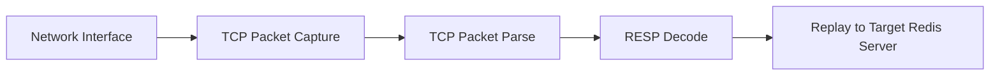
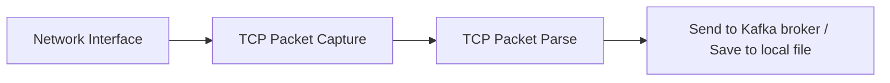
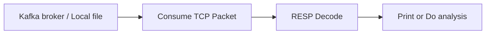

# Guide

This is a tool project using pcap library to parse RESP protocol and then replay to a target redis-compatible server.
This tool is also support dump the tcp packet and send to kafka or save to local file. Later we can consume data from kafka or local file and do analysis.

# Architecture

Replay to target redis server:



Send tcp packet to kafka:



Consume tcp packet from kafka:



# Steps for build

## Install pcap library

```bash
sudo apt-get install libpcap-dev
```

## Build pcap_resp_replay

### Install OpenJDK 17.x

```bash
sudo apt-get install openjdk-17-jdk
export JAVA_HOME=/usr/lib/jvm/java-17-openjdk-amd64
export PATH=$PATH:$JAVA_HOME/bin
java -version
```

### Install Gradle 8.14.x

```bash
wget https://services.gradle.org/distributions/gradle-8.14.2-bin.zip
unzip gradle-8.14.2-bin.zip
export GRADLE_HOME=$PWD/gradle-8.14.2
export PATH=$PATH:$GRADLE_HOME/bin
gradle -v
```

### Build

```bash
git clone https://github.com/montplex/pcap_resp_replay.git
cd pcap_resp_replay
gradle jar
cd build/libs
java -jar pcap_resp_replay-1.0.0.jar --help
```

Command-line interface documentation:

```
Usage: java -jar pcap_resp_replay-1.0.0.jar [-CDL] [-b=<bufferSize>]
       [-B=<sendCmdBatchSize>] [-c=<maxPacketCount>] [-f=<filter>]
       [-g=<kafkaGroupId>] [-h=<host>] [-H=<targetHost>] [-i=<itf>]
       [-k=<kafkaBroker>] [-m=<bigKeyTopNum>] [-n=<consumeMaxNum>]
       [-o=<offsetFromTime>] [-p=<port>] [-P=<targetPort>] [-r=<readTimeout>]
       [-R=<readScale>] [-s=<runningSeconds>] [-t=<kafkaTopic>]
       [-W=<writeScale>]
TCP monitor / filter and then replay / redirect to target redis server or kafka.
  -b, --buffer-size=<bufferSize>
                          buffer size, default: 1048576 (1M)
  -B, --send-cmd-batch-size=<sendCmdBatchSize>
                          send cmd pipeline size, default: 1, max 10, means no
                            pipeline
  -c, --max-packet-count=<maxPacketCount>
                          receive max packet count, default: -1, means not limit
  -C, --pipe-consumer     pipe consumer from kafka, default: false
  -D, --pipe-dump         pipe dump to kafka, default: false
  -f, --filter=<filter>   filter, default: tcp dst port 6379
  -g, --kafka-group-id=<kafkaGroupId>
                          pipe consumer from kafka group id, default:
                            pcap_resp_replay
  -h, --host=<host>       host, eg: localhost
  -H, --target-host=<targetHost>
                          target host, eg: localhost
  -i, --interface=<itf>   interface, eg: lo, default: lo
  -k, --kafka-broker=<kafkaBroker>
                          kafka broker, eg: localhost:9092
  -L, --pipe-dump-local   pipe dump to local file, default: false
  -m, --big-key-top-num=<bigKeyTopNum>
                          big key top num, default: 10, max 100
  -n, --pipe-consume-max-num=<consumeMaxNum>
                          pipe consume max num, default: 10000
  -o, --offset-from-time=<offsetFromTime>
                          offset from time, eg: 2021-01-01 00:00:00
  -p, --port=<port>       port, eg: 6379
  -P, --target-port=<targetPort>
                          target port, eg: 6380
  -r, --read-timeout=<readTimeout>
                          read timeout seconds by capture from network
                            interface, default: 10
  -R, --read-scale=<readScale>
                          read scale, default: 1, max 100
  -s, --running-seconds=<runningSeconds>
                          running seconds, default: 60, max 36000
  -t, --kafka-topic=<kafkaTopic>
                          kafka topic, default: pcap_resp_replay
  -W, --write-scale=<writeScale>
                          write scale, default: 1, max 100
```

# Steps for replay to target redis server

## Prepare two redis servers

```bash
redis-server --daemonize yes --port 6379
redis-server --daemonize yes --port 6380
```

## Run pcap_resp_replay

Important: Root permissions are required to execute this tool, as it utilizes pcap (packet capture) functionality to
intercept network traffic at the interface level.

```bash
cd pcap_resp_replay
cd bulid/libs
sudo java -jar pcap_resp_replay-1.0.0.jar -i lo -p 6379 -H localhost -P 6380 -s 60
```

## Mock a workload

```bash
redis-benchmark -h localhost -p 6379 -c 1 -n 1000000 -r 1000000 -t set,get,del,ping
```

## Compare db size

```bash
redis-cli -h localhost -p 6379 dbsize
redis-cli -h localhost -p 6380 dbsize
```

# Steps for send tcp packet to kafka

## Prepare zookeeper and kafka

todo

## Prepare one redis server

```bash
redis-server --daemonize yes --port 6379
```

## Run pcap_resp_replay

```bash
sudo java -jar pcap_resp_replay-1.0.0.jar -i lo -p 6379 -D -k localhost:9092 -s 60
```

## Mock a workload

```bash
redis-benchmark -h localhost -p 6379 -c 1 -n 1000000 -r 1000000 -t set,get,del,ping
```

## Consume tcp packet from kafka

```bash
java -jar pcap_resp_replay-1.0.0.jar -C -k localhost:9092 -n 1000
```

Results:

```text
GET key:263630
2026-01-16 12:14:35
value:263630
SET key:379682 value:379682
GET key:447042
GET key:200759
SET key:780682 value:780682
GET key:876168
GET key:575495
SET key:866880 value:866880
GET key:811978
value:811978
SET key:860371 value:860371
SET key:193315 value:193315
SET key:143054 value:143054
GET key:292808
SET key:527193 value:527193
GET key:541023
SET key:946701 value:946701
GET key:717288
value:717288
GET key:912044
value:912044
SET key:67914 value:67914
GET key:946689
GET key:484088
SET key:598101 value:598101
GET key:737216
SET key:679947 value:679947
SET key:121840 value:121840
SET key:608601 value:608601
SET key:496165 value:496165
SET key:743459 value:743459
SET key:357233 value:357233
SET key:460981 value:460981
SET key:251816 value:251816
SET key:103069 value:103069
SET key:868872 value:868872
SET key:194275 value:194275
GET key:104706
value:104706
SET key:630311 value:630311
SET key:376553 value:376553
GET key:558421
SET key:899254 value:899254
GET key:990150
SET key:818614 value:818614
GET key:575478
GET key:6032
SET key:506910 value:506910
GET key:745399
GET key:272558
value:272558
SET key:773800 value:773800
SET key:200681 value:200681
SET key:219296 value:219296
GET key:19484
value:19484
skipped print OK result count: 29
skipped print NULL result count: 14
+-----------------------+-----------------------+----------------+-----------------+-----------------+
| valid resp data count | client received count | read cmd count | write cmd count | other cmd count |
+-----------------------+-----------------------+----------------+-----------------+-----------------+
| 100                   | 50                    | 21             | 29              | 0               |
+-----------------------+-----------------------+----------------+-----------------+-----------------+
+-----+-------+
| cmd | count |
+-----+-------+
| GET | 21    |
| SET | 29    |
+-----+-------+
```

# Deploy this tool in K8S cluster

## Build docker image

```bash
docker build -t montplex/pcap_resp_replay:1.0.0 .
```

You need load docker image to k8s cluster.

## Deploy

sample yaml:

```yaml
apiVersion: v1
kind: Pod
metadata:
  name: target-redis-pod
  labels:
    app: redis-app
spec:
  containers:
    - name: redis-container
      image: docker.1ms.run/library/redis:7.2
      ports:
        - containerPort: 6379
          name: redis-port
---
apiVersion: v1
kind: Service
metadata:
  name: target-redis-service
spec:
  selector:
    app: redis-app
  ports:
    - port: 6379
      targetPort: 6379

---
apiVersion: v1
kind: Pod
metadata:
  name: pcap-replay-pod
  labels:
    app: pcap-replay-app
spec:
  containers:
    - name: redis-container
      image: docker.1ms.run/library/redis:7.2
      ports:
        - containerPort: 6379
          name: redis-port
      readinessProbe:
        exec:
          command:
            - redis-cli
            - ping
        initialDelaySeconds: 2
        periodSeconds: 2
      livenessProbe:
        exec:
          command:
            - redis-cli
            - ping
        initialDelaySeconds: 2
        periodSeconds: 2
    - name: redis-benchmark-container
      image: docker.1ms.run/library/redis:7.2
      command:
        - sh
        - -c
        - |
          until redis-cli -h localhost ping; do
            echo "Waiting for Redis to be ready..."
            sleep 2
          done
          sleep 5
          redis-benchmark -c 1 -r 1000000 -n 1000000 -t get,set
    - name: pcap-replay-container
      image: montplex/pcap_resp_replay:1.0.0
      args:
        - -i
        - lo
        - -H
        - target-redis-service
        - -P
        - "6379"
        - -s
        - "60"
      resources:
        requests:
          memory: "1024Mi"
          cpu: "1000m"
        limits:
          memory: "1024Mi"
          cpu: "1000m"
```

# Refer

[pcap](https://en.wikipedia.org/wiki/Pcap)
