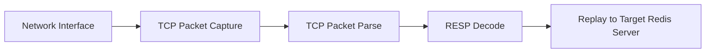

# Guide

This is a tool project using pcap library to parse RESP protocol and then replay to a target redis-compatible server.

# Architecture



# Steps

## Install pcap library

```bash
sudo apt-get install libpcap-dev
```

## Build pcap_resp_replay

### Install OpenJDK 17.x

```bash
sudo apt-get install openjdk-17-jdk
export JAVA_HOME=/usr/lib/jvm/java-17-openjdk-amd64
export PATH=$PATH:$JAVA_HOME/bin
java -version
```

### Install Gradle 8.14.x

```bash
wget https://services.gradle.org/distributions/gradle-8.14.2-bin.zip
unzip gradle-8.14.2-bin.zip
export GRADLE_HOME=$PWD/gradle-8.14.2
export PATH=$PATH:$GRADLE_HOME/bin
gradle -v
```

### Build

```bash
git clone https://github.com/montplex/pcap_resp_replay.git
cd pcap_resp_replay
gradle jar
cd build/libs
java -jar pcap_resp_replay-1.0.0.jar --help
```

Command-line interface documentation:

```
Usage: java -jar pcap_resp_replay-1.0.0.jar [-d] [-b=<bufferSize>]
       [-B=<sendCmdBatchSize>] [-c=<maxPacketCount>] [-f=<filter>] [-h=<host>]
       [-H=<targetHost>] [-i=<itf>] [-m=<bigKeyTopNum>] [-p=<port>]
       [-P=<targetPort>] [-r=<readTimeout>] [-R=<readScale>]
       [-s=<runningSeconds>] [-W=<writeScale>]
TCP monitor / filter and then replay / redirect to target redis server.
  -b, --buffer-size=<bufferSize>
                          buffer size, default: 1048576 (1M)
  -B, --send-cmd-batch-size=<sendCmdBatchSize>
                          send cmd pipeline size, default: 1, max 10, means no
                            pipeline
  -c, --max-packet-count=<maxPacketCount>
                          receive max packet count, default: -1, means not limit
  -d, --debug             debug mode, if true, just log resp data, skip execute
                            to target redis server
  -f, --filter=<filter>   filter, default: tcp dst port 6379
  -h, --host=<host>       host, eg: localhost
  -H, --target-host=<targetHost>
                          target host, eg: localhost
  -i, --interface=<itf>   interface, eg: lo, default: lo
  -m, --big-key-top-num=<bigKeyTopNum>
                          big key top num, default: 10, max 100
  -p, --port=<port>       port, eg: 6379
  -P, --target-port=<targetPort>
                          target port, eg: 6380
  -r, --read-timeout=<readTimeout>
                          read timeout seconds by capture from network
                            interface, default: 10
  -R, --read-scale=<readScale>
                          read scale, default: 1, max 100
  -s, --running-seconds=<runningSeconds>
                          running seconds, default: 60, max 36000
  -W, --write-scale=<writeScale>
                          write scale, default: 1, max 100
```

## Prepare two redis servers

```bash
redis-server --daemonize yes --port 6379
redis-server --daemonize yes --port 6380
```

## Run pcap_resp_replay

Important: Root permissions are required to execute this tool, as it utilizes pcap (packet capture) functionality to
intercept network traffic at the interface level.

```bash
cd pcap_resp_replay
cd bulid/libs
sudo java -jar pcap_resp_replay-1.0.0.jar -i lo -p 6379 -H localhost -P 6380 -s 60
```

## Mock a workload

```bash
redis-benchmark -h localhost -p 6379 -c 1 -n 1000000 -r 1000000 -t set,get,del,ping
```

## Compare db size

```bash
redis-cli -h localhost -p 6379 dbsize
redis-cli -h localhost -p 6380 dbsize
```

# Refer

[pcap](https://en.wikipedia.org/wiki/Pcap)
